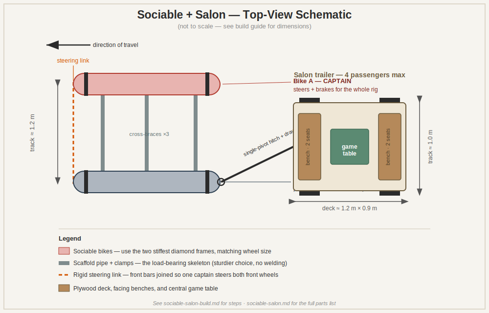

# Sociable + Salon — Step-by-Step Build Guide

## Summary

This guide walks the Berlin bike fixers through building a **Sociable** (two adult
bikes clamped side by side, two riders pedaling shoulder to shoulder, facing
forward) towing a **Salon** (a low four-wheel trailer with two facing benches and
a central game table). It's a no-weld, no-fabricator build tuned for the dry
July dirt tracks at camp: stable, low, slow, and sociable, with a literal table
for cards and games.

- **Full parts/quantities:** see [`sociable-salon.md`](./sociable-salon.md).
- **Bike-fixing parts and triage:** see [`fix-list.md`](./fix-list.md).
- **This file:** the build sequence, the key spec decisions, the pre-camp
  shopping list, and reference builds at the end.

> Build the Sociable first — it's a guaranteed win. Add the Salon if energy and
> parts allow. The two hitch together into one rig.

---

## Key decisions (made for you — adjust on site if needed)

### Track width: **≈ 1.2 m** (center-to-center of the two bikes)
Wide enough to be stable and self-balancing with two riders, narrow enough to
track bumps without racking the frame and to clear typical forest gates/paths.
**Check the narrowest gate or track you'll ride before locking this in.**

### Which two bikes: **the two stiffest diamond-frame bikes**
Use the **red "Karat/Heriber" men's diamond-frame** and the **navy men's
diamond-frame** bikes. Reasons:
- Diamond (men's) frames are far stiffer than step-throughs and give clean,
  strong clamping points for the cross-braces and steering link.
- At least one already runs fat **Schwalbe Marathon Plus** tires — ideal for dirt.
- **Condition:** confirm during triage that **both wheels are the same ETRTO
  size** (likely `622` / 28"). If they don't match, swap in a wheel from the
  stash so they do.
- **Comfort alternative:** if you'd rather have easy step-through mounting for a
  relaxed cruiser feel, substitute two matching step-throughs (e.g. the red
  ladies' + the green), accepting a slightly less rigid structure.

### Trailer footprint: **deck ≈ 1.2 m (fore-aft) × 0.9 m (wide), wheel track ≈ 1.0 m**
Two benches facing each other (2 seats each) with a low central table.
**4 passengers maximum.**
> **Loading reality:** two pedalers towing four seated adults on dirt is hard
> work. Treat **2 passengers as the comfortable cruising load** and **4 as the
> occasional flat-ground maximum.** Keep it low and slow.

### Structure: **scaffold pipe (48.3 mm) + clamp fittings — the sturdier choice**
Between plain square tube and scaffold pipe + clamps, **scaffold pipe + clamps
wins on sturdiness** for a 4-person load:
- Clamp fittings (Kee Klamp / Interclamp / scaffold couplers) give **engineered,
  load-rated, rigid joints with no welding** and let you re-tune geometry on site.
- Square tube relies on drilled lap joints and the bikes' own rack strength, which
  is weaker and fussier to get rigid.
- **Trade-off:** scaffold pipe is heavier and the fittings cost more. Worth it here.
- **Use U-bolts only** to attach the scaffold pipe to the **bikes' existing rear
  racks/frames** (where pipe-to-bike meets); everything else is pipe + clamps.

---

## Pre-camp shopping list (Berlin fixers — buy and bring)

Structure is mostly free from the pile; this is what to purchase **before** camp.
Finalize exact counts/lengths from the layout, but this gets you close.

### Structural
- [ ] **Scaffold pipe, 48.3 mm OD galvanized steel — ~18 m total** (buy in 6 m
      sticks and cut on site). Covers: Sociable cross-braces (~3 × 1.3 m),
      trailer frame perimeter + cross-members (~9–10 m), drawbar (~1.5 m), spare.
- [ ] **Clamp fittings (Kee Klamp / Interclamp type), galvanized — ~28–34 total**
      starter set: ~12 three-way / corner (90°) fittings, ~6 tees, ~6 elbows,
      ~4 swivel/adjustable, ~4 flange/base plates. Confirm against final layout.
- [ ] **Hex/grub key** for the clamp fittings (usually a single size — buy two).
- [ ] **U-bolts** sized to clamp 48 mm pipe to the bikes' rack/frame tubing,
      with saddles + backing plates + nyloc nuts — **~10–12**.

### Trailer body & hitch
- [ ] **18 mm exterior plywood — 1 sheet (2.4 × 1.2 m)** (deck + 2 benches + table).
- [ ] **Single-pivot trailer hitch** (Burley-style cargo hitch) **×1**, or an
      eye-bolt + clevis kit to make one.
- [ ] **Coach bolts / deck screws / washers / nyloc nuts** — assortment.
- [ ] Foam + outdoor fabric for bench cushions *(optional comfort)*.

### Steering, safety, fun
- [ ] **Steering link stock:** 1 × length of steel flat bar (~5 mm × 30 mm) or
      small tube, + bolts, to join the two front stems rigidly.
- [ ] **Reflectors + 1 rear light** (the rig is wide and low — be visible).
- [ ] **1 loud bell or horn** (non-negotiable).
- [ ] **Thread-lock** (or rely on nyloc nuts) so nothing vibrates loose on bumps.

### Tools to bring (if not already in the kit)
- [ ] Hacksaw **or** angle grinder + metal cutting discs
- [ ] Drill + metal bits + a step bit (clean holes for U-bolts/steering link)
- [ ] Spanners/sockets to match all fasteners + 2 adjustable wrenches
- [ ] Tape measure, marker, file, clamps to hold pipe while working
- [ ] (Bike-fixing tools live in [`fix-list.md`](./fix-list.md))

---

## Build sequence

### Phase 0 — Prep (do alongside bike triage)
1. Confirm the two Sociable bikes are **rideable on their own first** (brakes,
   tubes, drivetrain) using [`fix-list.md`](./fix-list.md). Don't build on a bike
   that isn't sound.
2. Strip clog-prone **mudguards** off both Sociable bikes and any trailer-donor
   wheels headed for dirt.
3. Fit the **fattest matching good tires** you have to both Sociable bikes.

### Phase 1 — The Sociable cross-frame
1. Stand both bikes upright, parallel, **~1.2 m saddle-to-saddle**. Check that
   handlebars and riders' elbows won't collide — rotate or swap one bar if needed.
2. Clamp the **rear cross-brace** (scaffold pipe across both rear racks) first
   using U-bolts. This sets and holds the track width. Get it square.
3. Add the **mid brace** and **front brace** (front clamps to the head tubes /
   fork crowns or front racks). Three braces = a rigid, non-racking frame.
4. Stand back and confirm both bikes stay vertical and parallel with no twist.

### Phase 2 — Steering link (the one part to get right)
1. Clamp/bolt a short steel bar to **each** handlebar stem.
2. Join the two bars with a **single rigid cross-link** so turning one set of
   bars turns **both** front wheels together.
3. **Test full lock both directions** — no fouling on braces, tires, or cables.
4. Designate **Bike A as captain** (steers + brakes). Bike B rider keeps hands
   off the bars.
   > Do **not** leave the two front ends independent — two steerers fight each
   > other. The link is mandatory. A little tire scrub in tight turns is fine at
   > low speed.

### Phase 3 — Sociable shakedown
1. Confirm **both brake sets** work; the captain's especially.
2. Test ride **empty** (push it), then **one rider**, then **two-up**.
3. Re-torque every bolt after the first ride.

### Phase 4 — The Salon trailer frame
1. Build a **rectangular base frame** from scaffold pipe + corner clamps:
   **≈ 1.2 m (fore-aft) × 0.9 m (wide).** Add 1–2 cross-members for the deck.
2. Keep it **low** — the deck should sit just above the wheels for a low center
   of gravity.

### Phase 5 — Wheel mounts (the clever no-weld trick)
1. Use **4 donor bike forks** from the pile as wheel mounts (or 2 forks + 1 rear
   triangle). Clamp/bolt one at each corner of the frame, **pointing straight**
   (the trailer doesn't steer — it just trails).
2. Drop a **wheel with a good fat tire** into each fork's dropouts and secure.
3. Set the **wheel track to ≈ 1.0 m**. Confirm all four sit level and the frame
   doesn't rock.

### Phase 6 — Deck, benches, table
1. Deck the frame with **18 mm plywood**; bolt it down.
2. Build **two low benches facing each other** (~0.35 m seat height), one near
   each end, 2 seats each.
3. Mount the **central table** between them; bolt or strap a board game down so it
   survives bumps. Add cushions if you made them.

### Phase 7 — Hitch and drawbar
1. Mount the **single-pivot hitch** at the captain-side rear dropout/axle of the
   Sociable.
2. Run a scaffold-pipe **drawbar** from the hitch to the front of the trailer
   frame. Make it long enough that the trailer can't clip heels or wheels in tight
   turns. A single pivot lets the trailer follow ground bumps without twisting.

### Phase 8 — Full-rig test and safety
1. Tow **empty**, then **2 passengers**, watching for jackknife at slow tight turns.
2. Only attempt the **4-passenger max** on flat, smooth ground at walking pace.
3. Run the safety checklist in [`sociable-salon.md`](./sociable-salon.md):
   working brakes, all bolts torqued (**re-check daily** — vibration + dirt loosen
   things), no pinch points, full steering lock clear, trailer can't jackknife into
   riders, reflectors/light fitted, helmets available.

---

## References — similar builds (pictures + instructions)

### Open-source, bolt-together frames (no welding)
- **N55 XYZ Spaceframe Vehicles** — the canonical open-source, bolt-together,
  no-weld human-powered vehicle system (incl. an eight-wheeler). Manual + photos:
  <https://www.n55.dk/MANUALS/SPACEFRAMEVEHICLES/spaceframevehicles.html>
- **N55 XYZ — free DIY construction drawings (PDF):**
  <https://www.n55.dk/MANUALS/SPACEFRAMEVEHICLES/DIY.pdf>
- **XYZ Cargo** (N55 + Till Wolfer, Hamburg/Copenhagen) — modular cargo bikes,
  build photos and background:
  <https://www.xyzcargo.com/>
- **Low-Tech Magazine — "Modular Cargo Cycles"** — overview + photos, including
  the eight-wheeler that drew the most attention:
  <https://solar.lowtechmagazine.com/2014/05/modular-cargo-cycles/>
- **Resilience.org — "Modular Cargo Cycles"** — how the XYZ Node joints work:
  <https://www.resilience.org/stories/2014-05-07/modular-cargo-cycles/>
- **New Atlas — N55 spaceframe tricycle** — clear build photos:
  <https://newatlas.com/n55-xyz-spaceframe-vehicles/24163/>
- **OpenBikeWorks** — DIY bolt-together cargo bike inspired by N55, no welding:
  <http://openbikeworks.blogspot.com/p/what.html>

### Side-by-side & no-weld coupling (most relevant to the Sociable)
- **"How to build a side-by-side, sociable tandem bike"** (Christopher Carfi) —
  the no-weld method: square tube + U-bolts clamped over the rear racks, with
  photos and steps:
  <https://christophercarfi.com/2023/04/sociable-tandem.html>
- **Bike sidecar build (BikeHacks)** — fully bolted/threaded-pipe construction,
  no welding, real-world load notes:
  <https://www.bikehacks.com/bike-sidecar/>
- **Two-bike four-wheel vehicle patent (US 4,227,589)** — describes the
  track-rod/king-pin steering linkage that ties two bikes' front wheels together:
  <https://patents.justia.com/patent/4227589>

### Multi-person / sociable inspiration
- **Party bike / ConferenceBike (Wikipedia)** — the multi-person lineage; note the
  key idea that one person steers and brakes while everyone else just pedals:
  <https://en.wikipedia.org/wiki/Party_bike>
- **Rat Rod Bikes — homemade side-hack thread** — photos of DIY side-by-side /
  sidecar bike builds for ideas and detailing:
  <https://ratrodbikes.com/threads/jack-the-hack.120811/>

---

*Files in this set: `sociable-salon-build.md` (this guide) · `sociable-salon.md`
(parts list) · `fix-list.md` (bike fixing) · `sociable-salon-diagram.svg` (schematic).*
